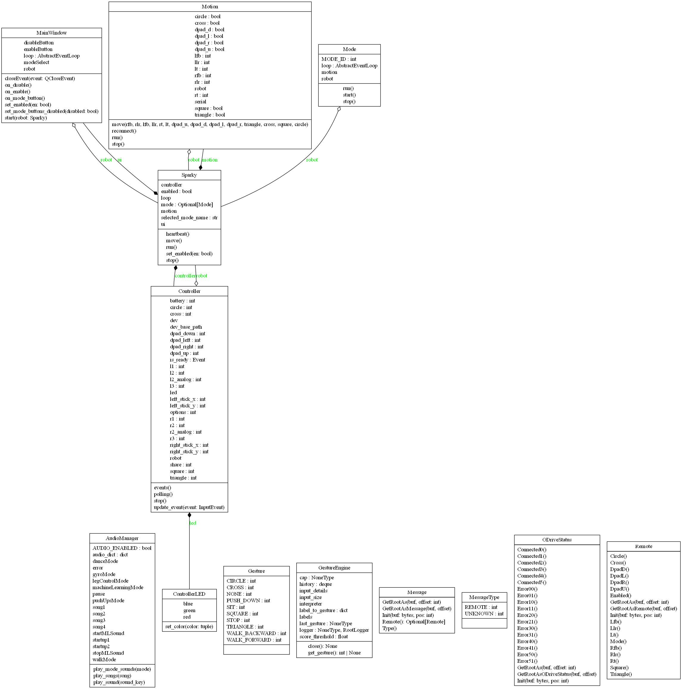
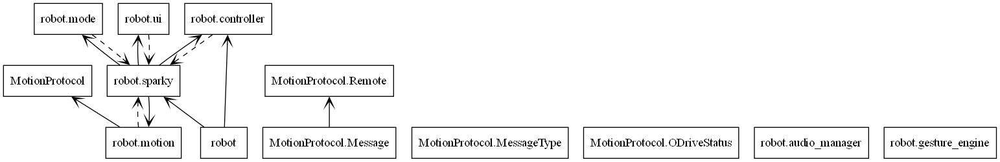

Motion Repository
==================

Motion High-Level Code Overview
---------------------------------

Upon running setup in main.cpp, the following happens:

* A serial monitor is set up

* sparky.setup() is called

* In sparky.setup(), serial connections are created for all 6 of the ODrives. The IMU is then initialized, and all ODrive connections are made

The majority of functionality occurs in sparky.update(), which is called from main.loop(). The following happen:

* The current time is fetched. If it has been < 10ms since the last update, sparky does not update

* Ensures controller and ODrives are connected

* Checks current mode, then calls the respective method in kinematics.cpp (walk, pushUp, or dance)

* Checks the IMU for current roll/pitch, and stores them in class variables

* Checks for updates to controller state, and stores button values in class variables

* Checks for ODrive errors

Motion Low-Level Code Overview
---------------------------------

.. dropdown:: Axis.cpp

   Contains methods for initializing axis, fetching coordinates, and resetting ODrives. Contains method for sending position to ODrives.
   
   .. tab-set:: 
   
      .. tab-item:: Axis:Axis()
      
         .. code-block:: c
         
            Axis::Axis(Odrive& _odrive, int _id)
   
         Sets ODrive and id of axis to specified parameters (there are 2 Odrives per axis)
   
      .. tab-item:: Axis :: init()
   
         Checks for errors then tries to reset them by calling

      .. tab-item:: Axis :: reset()

        .. code-block:: none

         Updates zero position offsets

         Sets the axis to closed loop by calling ``--Axis::setClosedLoop()``

         Calls Axis::fetchState() and logs the state of the axis

         Sends axis config to ODrives on each axis

         Checks if ODrive response has a nonzero length

         If the response length is nonzero, sending the axis config failed

         ODrive response is logged if setting the axis config failed

      .. tab-item:: Axis :: fetchOffset()

          .. code-block:: none

            Gets the position estimate of the ODrive, converts it to a float, and stores it in offset

      .. tab-item:: Axis::reset()

         .. code-block:: none

            - Attempts to reset the ODrive by setting controller, encoder, motor, and general error flags to 0

            - Sends “sc:\n” to the ODrive, clearing communications

      .. tab-item:: Axis::setClosedLoop()

         .. code-block:: none

            - Sends data to the ODrive, requesting closed loop state

      .. tab-item:: Axis::fetchState()

         .. code-block:: none

            - Returns an integer state of the ODrive's control mode

      .. tab-item:: Axis::move(float pos)

         .. code-block:: none

            - Checks if provided position is different from target position

            - If positions are different, sets target position to pos, then sends targetPos + offset to the ODrive

      .. tab-item:: Axis::getOffset()

         .. code-block:: none

            - Returns the current offset from starting position

      .. tab-item:: Axis::fetchError()

         .. code-block:: none

            - Returns ODrive error as an integer

      .. tab-item:: Axis::setSpeed(float speed)

         .. code-block:: none

            - Takes a float in, multiplies it by static GLOBAL_SPEED variable, then logs the calculated speed

            - Sets speed of each axis of the ODrive to calculated speed

.. dropdown:: kinematics.cpp

   Contains method for inverse kinematics calculations, which takes position (x, y, z, roll, pitch, yaw), and translates them to relative ODrive movements for each joint. Contains methods for walking, pushups, and dancing.

   .. tab-set::
   
      .. tab-item:: Kinematics::translate
      
         .. code-block:: c

            Kinematics::translate(int leg, float xIn, float yIn, float zIn, float roll, float pitch, float yawIn)

         - Inverse kinematics calculation that takes in the requested position of a leg, then outputs necessary hip/shoulder/knee angles

         - Figure it out if you really need to. You probably don't.

      .. tab-item:: Kinematics::walk
      
         .. code-block:: c

            Kinematics::walk(int RFB, int RLR, int LT, float IMUpitch, float IMUroll)

         (Implementation handles walking logic)

      .. tab-item:: Kinematics::pushUp
      
         .. code-block:: c

            Kinematics::pushUp(bool cross_press, bool triangle_press, float IMUpitch, float IMUroll)

         - Checks if cross or triangle are pressed. If cross is pressed, all legs go down. If triangle is pressed, only the back legs go down. If both are pressed, all legs go down.

         - Corrects for roll and pitch based on IMU data, scaled by 0.3

      .. tab-item:: Kinematics::dance
      
         .. code-block:: c

            Kinematics::dance(bool up, bool down, bool left, bool right, float IMUpitch, float IMUroll)

         - Loops through step 1-4

         - Based on the given D-pad input, chooses one of the following

.. dropdown:: leg.cpp

   Contains helper method for movement of all joints in a leg.

   .. tab-set::

      .. tab-item:: Leg::move(JointAngles angles)

         .. code-block:: c

            Leg::move(JointAngles angles)

         - Moves the leg by updating all three joint motors (hip, shoulder, knee) to their respective target angles.

         - Calls hip.move(), shoulder.move(), and knee.move() with the given joint angles.

.. dropdown:: log.cpp

   Contains helper method for logging errors/information while DEBUG flag is set. Running in debug mode slows serial communications for the rest of the robot.

   .. tab-set::

      .. tab-item:: Leg::move(JointAngles angles)

         .. code-block:: none

            Log(const char* format, ...)

            - Variadic function that prints formatted messages to the serial monitor.

            - Executes only when the DEBUG flag is enabled to prevent slowdowns during normal operation.

            - Uses va_list to handle variable arguments and SerialMon.vprintf() for formatted output.

.. dropdown:: main.cpp

   Initializes serial communications of the robot, then calls setup method in sparky.cpp. Contains loop code, which calls update method in sparky.cpp.

   .. tab-set::

      .. tab-item:: setup()

         .. code-block:: none

            - Initializes the serial monitor at 115200 baud.

            - Prints crash reports if available.

            - Logs initialization message.

            - Calls sparky.setup() to initialize all components.

      .. tab-item:: loop()

         .. code-block:: none

            - Main loop repeatedly calls sparky.update() to process robot logic and motion control.

.. dropdown:: odrive.cpp

   Contains methods for initializing and connecting to an ODrive. Initializes axis for each ODrive. Defines parameters for ODrive setup.

   .. tab-set::

      .. tab-item:: ODrive::init()

         - Sends configuration commands to the ODrive hardware from a predefined array.

         - Logs any failed configuration responses.

         - Initializes both axis0 and axis1.

         - Sends "ss" to save the ODrive configuration.

         - Marks the ODrive as initialized.

      .. tab-item:: ODrive::connect()

         .. code-block:: none

            - Establishes serial communication with the ODrive.

            - Flushes input/output buffers to clear any previous communication.

            - Reads firmware version and serial number to verify a valid connection.

            - If connection succeeds, reconstructs and stores the serial number.

            - Logs connection status and initializes the ODrive.

            - Sets timeouts and flags _connected to true.

.. dropdown:: sparky.cpp

   Contains setup method, which initializes all serial communications on the robot. Contains update method, which is called in the main.cpp loop. Update checks tick time so that the robot is updated every 10ms, then checks which mode (walk, pushup, dance) the robot is in. IMU data is sent to the respective kinematics function. The IMU is then updated with current values. Updates to internal states are then made (button presses, operation mode).

   .. tab-set::

      .. tab-item:: Sparky::Sparky()

         .. code-block:: none

            - Constructor initializing six ODrive objects, four Leg objects, and a Kinematics instance.

            - Maps legs and axes to specific ODrives and serial interfaces.

      .. tab-item:: Sparky::setup()

         .. code-block:: none

            - Initializes serial communication for USB and six ODrives.

            - Initializes and configures the MPU6050 IMU with acceleration and gyro ranges.

            - Connects to each ODrive by calling od.connect().

            - Logs setup status.

      .. tab-item:: Sparky::update()

         .. code-block:: none

            - Called every TICK_MS (10ms).

            - Updates IMU readings, calculates pitch and roll using a complementary filter.

            - Handles remote control communication and updates robot motion mode.

            - Commands kinematics functions (walk, push-up, dance) based on mode.

            - Manages ODrive and axis error checking, reconnections, and resets as needed.

            - Handles MotionProtocol messages received via SerialUSB.

            - Sends ODrive connection and error status back through USB using FlatBuffers.

      .. tab-item:: Sparky::setSpeed(float speed)

         .. code-block:: none

            - Updates the motion speed scaling factor across all ODrives.

            - Calls axis0.setSpeed() and axis1.setSpeed() for every ODrive.

.. dropdown:: utils.cpp

   Contains methods for trimming stick positions (controller deadzone) and filtering motions.

   .. tab-set::

      .. tab-item:: thresholdStick(int pos)

         .. code-block:: none

            - Applies a deadzone threshold (±10) to controller stick input.

            - Returns 0 if the stick value is within threshold; otherwise returns the raw value.

      .. tab-item:: filter()

         .. code-block:: c

            filter(float prevValue, float currentValue, int filter)

         - Applies a simple weighted moving average filter.

         - Smooths motion input by blending previous and current values based on filter weight.

Platform Repository
===================

Platform High-Level Code Overview
----------------------------------

.. dropdown:: Message.py

   Automatically generated FlatBuffers module defining the Message object for robot communication. Handles serialization and deserialization of messages containing type information and optional Remote data.

.. dropdown:: Message.pyi

   Type stub providing signatures and type hints for the generated Message FlatBuffers class and helper functions.

.. dropdown:: MessageType.py

   Enumerates message types for FlatBuffers communication schema. Defines integer constants representing message categories.

.. dropdown:: MessageType.pyi

   Type stub defining type hints and integer constants for message types.

.. dropdown:: ODriveStatus.py

   Automatically generated FlatBuffers module defining the structure for ODrive connection and error reporting across six motor controllers. Contains helper functions for FlatBuffers serialization.

.. dropdown:: ODriveStatus.pyi

   Type stub defining methods and type hints for the ODriveStatus class and its FlatBuffers builder helper functions.

.. dropdown:: Remote.py

   Automatically generated FlatBuffers module defining the Remote class used for representing remote control input state (buttons, sticks, and triggers). Includes methods for reading, constructing, and serializing controller data fields.

.. dropdown:: Remote.pyi

   Type stub defining method signatures, field types, and FlatBuffers builder helpers for the Remote object.

Platform Low-Level Code Overview
--------------------------------

.. dropdown:: Message.py

   Contains generated FlatBuffers methods for reading, writing, and building Message objects.

   .. tab-set::

      .. tab-item:: Message.GetRootAs(buf, offset=0)

         Returns a new Message instance from a FlatBuffer, initializing its internal table at the given offset.

      .. tab-item:: Message.GetRootAsMessage(buf, offset=0)

         Deprecated alias of GetRootAs kept for backward compatibility.

      .. tab-item:: Message.Init(buf, pos)

         Initializes the FlatBuffers table reference for the Message.

      .. tab-item:: Message.Type()

         Returns the message type as an integer enum value.

      .. tab-item:: Message.Remote()

         Returns a Remote object if present; otherwise returns None.

      .. tab-item:: MessageStart(builder)

         Begins FlatBuffers object construction for a Message.

      .. tab-item:: MessageAddType(builder, type)

         Adds the type field to the FlatBuffer.

      .. tab-item:: MessageAddRemote(builder, remote)

         Adds a Remote object reference to the FlatBuffer.

      .. tab-item:: MessageEnd(builder)

         Finalizes and returns the Message object offset.

.. dropdown:: Message.pyi

   Contains type-stub equivalents for Message methods and FlatBuffers builder helpers.

   .. tab-set::

      .. tab-item:: Message.GetRootAs(buf, offset)

         Type-annotated version of GetRootAs returning a Message instance.

      .. tab-item:: Message.Init(buf, pos)

         Type-hinted initialization of the internal Message buffer.

      .. tab-item:: Message.Type()

         Returns a literal value from MessageType.

      .. tab-item:: Message.Remote()

         Returns a typed Remote object or None.

      .. tab-item:: MessageStart, MessageAddType, MessageAddRemote

         Type-annotated helper functions used to build Message objects.

.. dropdown:: MessageType.py

   Contains integer constants for message categories.

   .. tab-set::

      .. tab-item:: MessageType.UNKNOWN

         Integer constant 0 for unknown message type.

      .. tab-item:: MessageType.REMOTE

         Integer constant 1 for remote-control message type.

.. dropdown:: MessageType.pyi

   Contains typed constants matching the generated MessageType enum.

   .. tab-set::

      .. tab-item:: MessageType.UNKNOWN

         Type stub constant for unknown message type.

      .. tab-item:: MessageType.REMOTE

         Type stub constant for remote message type.

.. dropdown:: ODriveStatus.py

   Contains generated FlatBuffers methods for ODrive connectivity and error status.

   .. tab-set::

      .. tab-item:: ODriveStatus.GetRootAs(buf, offset=0)

         Initializes an ODriveStatus object from FlatBuffer data.

      .. tab-item:: ODriveStatus.GetRootAsODriveStatus(buf, offset=0)

         Deprecated alias for backward compatibility.

      .. tab-item:: ODriveStatus.Init(buf, pos)

         Initializes the internal FlatBuffers table reference.

      .. tab-item:: ODriveStatus.Connected0() through Connected5()

         Returns boolean connection flags for all six ODrives.

      .. tab-item:: ODriveStatus.Error00() through Error51()

         Returns integer error codes for all twelve ODrive axes.

      .. tab-item:: ODriveStatusStart(builder)

         Begins FlatBuffers object creation for ODriveStatus.

      .. tab-item:: ODriveStatusAddConnectedX(builder, connectedX)

         Adds one ODrive connection field (X = 0..5).

      .. tab-item:: ODriveStatusAddErrorXY(builder, errorXY)

         Adds one axis error code field.

      .. tab-item:: ODriveStatusEnd(builder)

         Finalizes and returns the ODriveStatus object offset.

.. dropdown:: ODriveStatus.pyi

   Contains type-stub definitions for ODriveStatus accessors and builder helpers.

   .. tab-set::

      .. tab-item:: ODriveStatus.GetRootAs and Init

         Type-stub versions for object construction and initialization.

      .. tab-item:: ODriveStatus.Connected0() through Connected5()

         Typed boolean accessors for ODrive connection flags.

      .. tab-item:: ODriveStatus.Error00() through Error51()

         Typed integer accessors for axis error codes.

      .. tab-item:: ODriveStatusStart/AddConnectedX/AddErrorXY/End

         Type-annotated FlatBuffers builder helpers.

.. dropdown:: Remote.py

   Contains generated FlatBuffers methods for remote state fields and builders.

   .. tab-set::

      .. tab-item:: Remote.GetRootAs(buf, offset=0)

         Initializes a Remote object from FlatBuffer data.

      .. tab-item:: Remote.GetRootAsRemote(buf, offset=0)

         Deprecated alias kept for backward compatibility.

      .. tab-item:: Remote.Init(buf, pos)

         Initializes the FlatBuffers table reference for Remote.

      .. tab-item:: Remote field accessors

         Enabled, Mode, stick and trigger values, D-pad flags, and button flags return the current remote state values.

      .. tab-item:: RemoteStart(builder)

         Begins FlatBuffers object creation for Remote.

      .. tab-item:: RemoteAddEnabled and RemoteAddMode

         Adds remote enabled and mode fields to the object.

      .. tab-item:: RemoteAddRlr/Rfb/Rt and RemoteAddLlr/Lfb/Lt

         Adds right and left analog inputs to the object.

      .. tab-item:: RemoteAddDpad* and RemoteAddTriangle/Cross/Square/Circle

         Adds D-pad and face-button states to the object.

      .. tab-item:: RemoteEnd(builder)

         Finalizes and returns the Remote object offset.

.. dropdown:: Remote.pyi

   Contains type-stub definitions for Remote accessors and FlatBuffers helper functions.

   .. tab-set::

      .. tab-item:: Remote.GetRootAs and Init

         Typed construction and initialization methods.

      .. tab-item:: Remote typed accessors

         Typed accessors for mode, analog values, D-pad states, and button states.

      .. tab-item:: RemoteStart/Add*/End

         Type-stub helpers for building a typed Remote object.

Platform/Robot Code
======================

High-Level Code Overview
------------------------

.. dropdown:: audio_manager.py

   Handles audio playback for the robot, including mixer initialization, sound/song loading, volume setup, and mode-specific playback.

.. dropdown:: controller.py

   Manages DualShock/PS4 controller input via evdev, updates LED state, and streams input state to the robot with asynchronous battery polling.

.. dropdown:: mode.py

   Defines the base Mode class used by robot operating modes and provides coroutine lifecycle handling for start, run, and stop.

.. dropdown:: motion.py

   Handles serial communication with the Teensy motion controller, including FlatBuffers message sending, status reception, and reconnect logic.

.. dropdown:: sparky.py

   Main orchestration module that initializes controller, motion, mode, and UI subsystems and manages runtime tasks.

.. dropdown:: ui.py

   PyQt6 user interface module defining MainWindow controls for enable/disable, mode selection, and async integration with the Sparky backend.

Low-Level Code Overview
------------------------

.. dropdown:: audio_manager.py

   Contains audio playback setup and utility methods.

   .. tab-set::

      .. tab-item:: AudioManager.__init__(self)

         Initializes the pygame mixer, loads sound assets, and sets per-sound volume defaults.

      .. tab-item:: AudioManager.play_sound(self, sound_key)

         Plays a sound effect by key when audio is enabled.

      .. tab-item:: AudioManager.play_mode_sounds(self, mode)

         Maps mode IDs to mode-switch sounds and plays the mapped clip.

      .. tab-item:: AudioManager.play_songs(self, song)

         Plays a random or specific song based on the input argument.

.. dropdown:: controller.py

   Contains controller device discovery, LED control, and asynchronous input processing.

   .. tab-set::

      .. tab-item:: ControllerLED.__init__(self, base_path)

         Initializes LED file paths for red, green, and blue channels.

      .. tab-item:: ControllerLED._write_color(self, path, value)

         Writes LED brightness values asynchronously.

      .. tab-item:: ControllerLED.set_color(self, color)

         Sets RGB LED output values for controller status feedback.

      .. tab-item:: Controller.__init__(self, robot)

         Initializes controller state, LED control, and readiness flags.

      .. tab-item:: Controller._find_controller_dev(self)

         Finds and returns the PS4 controller input device path.

      .. tab-item:: Controller.update_event(self, event)

         Updates buttons, sticks, and trigger state from evdev events.

      .. tab-item:: Controller.events(self)

         Asynchronously consumes controller events and updates robot input state.

      .. tab-item:: Controller.polling(self)

         Polls controller battery level on a periodic async interval.

      .. tab-item:: Controller.stop(self)

         Placeholder for stopping controller event processing.

      .. tab-item:: Controller.__str__(self)

         Returns a formatted summary string of current controller state.

.. dropdown:: mode.py

   Contains the base mode lifecycle interface for robot behavior modules.

   .. tab-set::

      .. tab-item:: Mode.__init__(self, robot)

         Stores references to the robot and motion subsystem.

      .. tab-item:: Mode.start(self)

         Coroutine placeholder implemented by concrete mode classes.

      .. tab-item:: Mode._run(self)

         Executes the mode coroutine and handles cancellation behavior.

      .. tab-item:: Mode.run(self)

         Creates an event loop and runs the mode coroutine continuously.

      .. tab-item:: Mode.stop(self)

         Cancels running mode tasks and stops the mode loop.

.. dropdown:: motion.py

   Contains serial transport logic between platform software and Teensy motion firmware.

   .. tab-set::

      .. tab-item:: Motion.__init__(self, robot)

         Initializes serial state and remote-control field defaults.

      .. tab-item:: Motion._connect(self)

         Opens serial communication to the Teensy motion controller.

      .. tab-item:: Motion.reconnect(self)

         Repeatedly attempts reconnection when serial communication fails.

      .. tab-item:: Motion._find_serial_dev(self)

         Scans ports and returns the Teensy serial device path.

      .. tab-item:: Motion.move(...)

         Updates cached controller values to be transmitted to firmware.

      .. tab-item:: Motion.stop(self)

         Resets all control values to neutral state.

      .. tab-item:: Motion.run(self)

         Builds and sends FlatBuffers messages, receives ODrive status responses, and handles errors/reconnects in a continuous loop.

.. dropdown:: sparky.py

   Contains top-level runtime orchestration for robot enable state, tasks, and mode transitions.

   .. tab-set::

      .. tab-item:: Sparky.__init__(self)

         Initializes core runtime fields, default mode, and executor resources.

      .. tab-item:: Sparky.__aenter__ and __aexit__

         Provides async context manager lifecycle hooks and cleanup behavior.

      .. tab-item:: Sparky.set_enabled(self, en)

         Enables a selected mode or disables active motion and mode tasks.

      .. tab-item:: Sparky.heartbeat(self)

         Runs LED heartbeat logic reflecting enable and health state.

      .. tab-item:: Sparky.move(self, *args, **kwargs)

         Forwards movement commands to the motion subsystem.

      .. tab-item:: Sparky.run(self)

         Starts UI, controller, motion, and heartbeat tasks and runs the app loop.

      .. tab-item:: Sparky.stop(self)

         Cancels tasks, resets LED state, and shuts down executor threads.

.. dropdown:: ui.py

   Contains the PyQt6 main window and asynchronous UI handlers for robot control.

   .. tab-set::

      .. tab-item:: MainWindow.__init__(self, robot)

         Loads platform UI layout, initializes controls, and connects async button handlers.

      .. tab-item:: MainWindow.set_mode_buttons_disabled(self, disabled)

         Enables or disables mode selection controls.

      .. tab-item:: MainWindow.set_enabled(self, en)

         Calls robot enable/disable flow and updates UI state accordingly.

      .. tab-item:: MainWindow.on_enable(self)

         Handles enable-button action and starts the selected mode.

      .. tab-item:: MainWindow.on_disable(self)

         Handles disable-button action and safely disables the robot.

      .. tab-item:: MainWindow.on_mode_button(self)

         Enforces mode button mutual exclusivity.

      .. tab-item:: MainWindow.start(cls, robot)

         Creates the Qt app and event loop bridge, then launches the main window.

      .. tab-item:: MainWindow.closeEvent(self, event)

         Handles app close and triggers graceful robot shutdown.
