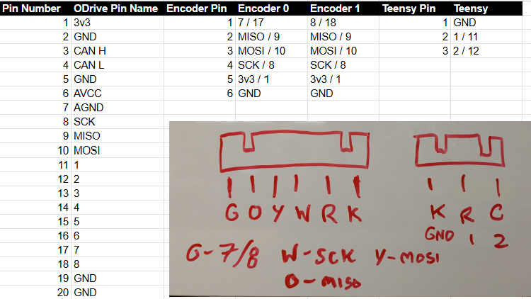
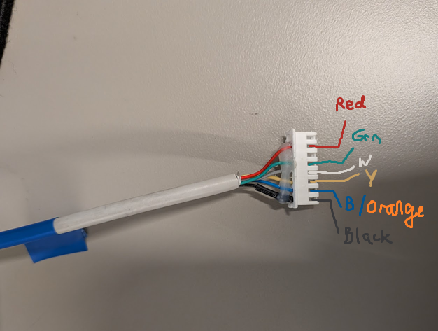
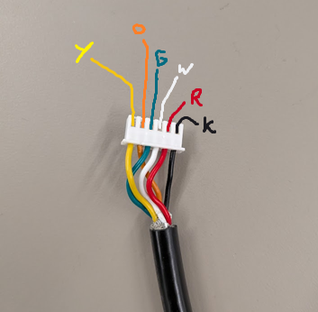

Communication Wires
===========================

Wiring Diagram
---------------

Here's a full configuration of how our teensy communication and encoder wiring is set up on the RamBOT.

    Communication Wires

Encoder Wiring
-----------------------

Currently to the encoders, we employ a 7-pin configuration with this order of pinout:

    Encoder Wire Configuration

Teensy Communication
-----------------------

Teensy communicates with each individual O-Drive over UART pins, which is wired in this configuration

    Communication Wires

