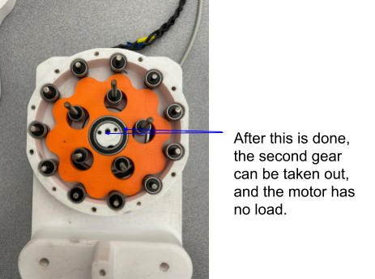
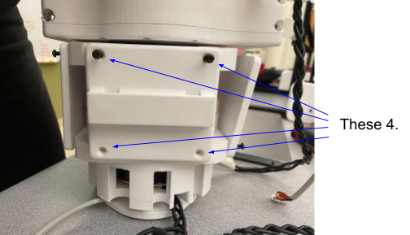

**Tools Needed:**

1. A screwdriver that is compatible with the hex head screws.
2. Allen Keys.
3. 9/32 socket and wrench

   1. Optional ½ socket for step 2.

When reassembling make sure to read the last step.

**Instructions:**

1. Reference How-To take off a leg to get to the point where the leg is
   off the robot.
2. Take off the 2 screws holding the two halves of the robot together.
   On the same side, you can remove the 2 screws that hold the tension
   donuts in place. The 4 screws are shown below in Figure 1.

.. image:: leg-images/image1.png
Figure 1.

3. Now you can take off the 3 plates at the top of the leg which also
   hold the leg parts together. Each plate has 4 screws, the location of
   the plates is shown in Figures 2, 3, and 4. The order in which plates
   come off does not matter.

Figure 2.

.. image:: leg-images/image3.png
Figure 3.

.. image:: leg-images/image4.png
Figure 4.

4. Now that all the plates have been taken off the two halves can be
   taken off. During this process, the 2 tension donuts and the foot
   should also come off with the 2 halves, these parts are shown in
   figure 5. For the next steps, we are going to look at the right half,
   which is the one that controls the foot motor.

Figure 5.

5. Looking at the foot-controlling half, we will deconstruct this to the
   point where the motor will have no load. The first step is to remove
   spacers held by 2 screws, as shown in Figure 6.

.. image:: leg-images/image6.png
Figure 6.

6. After the spacer is taken off the part that holds the belt will be
   taken off. This is done by taking off the 5 nuts that are holding it
   in place shown in Figure 7.

Figure 7.

7. The next step is to take off the 10 screws that are holding the top
   plate to the bottom as shown in Figure 8.

.. image:: leg-images/image8.png
Figure 8.

8. After the plate comes off you will see the gadget that makes a
   cycloidal drive. Now to take this apart use the right-sized Allen
   keys to take the cap off. This is shown in Figure 9.

Figure 9.

9. After this is done you will need to take off the 2 screws that hold
   the bearing and gear in place. When this is done you can take off the
   top gear, as shown in Figure 10.

.. image:: leg-images/image10.png
Figure 10.  

1.  For the second gear, there will be another 2 screws that will need
    to be taken off as shown in figure 11.

.. image:: leg-images/image11.png
Figure 11.

11. If you want to remove the cage that holds the motor in place, you
    can put the large-cap taken off in Step 7 back on. Doing this will
    help prevent the bearings from falling out. You can also take the
    cage off before step 7 if you know the cage will need to be removed.
    This requires to take off the 11 screws on the back shown in Figure
    12. It is important to not take off the encoder plate. If this is
    done the encoders will need to be reinitialized.

Figure 12.

12. Now we will move on to the second half of the entire leg shown in
    Figure 13. This half controls the shoulder. Disassembling this is
    the exact same way as the other half, the only difference is that
    there is a leg plate, rather than the piece that holds the belt in
    place that was taken off in step 6.

Figure 13.

13. To Disassemble completely repeat steps 6-11.
14. To Reassemble do the same steps in reverse order. When putting on
    any bolts/screws only hand tighten them. This includes the socket
    wrench. Hold the socket in your hand, overtightening things can
    cause inconvenient breaks in the plastic, and more issues.
