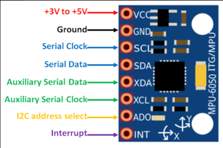
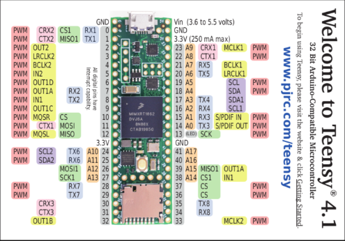

Hardware Documentation
======================

IMU
-----

The RamBOT primary functions are controlled through two core
microcontrollers and an Internal Measurement Unit. (IMU)

Teensy 4.1
-----------

The Teensy 4.1 microcontroller is the RamBOTs core motion controller,
communicating with the ODrives and motor encoders and utilizing the IMU
for balance during operation.

Pinout Tables
----------------

Here is a full pinout of how our Teensy 4.1 communicates with the
ODrives & IMU to control motion on the RamBOT:

+--------+-----+-------------+-------------+-------------+------+
| Teensy | IMU | O-Drive (#) | Teensy UART | O-Drive PIN | LEDs |
+========+=====+=============+=============+=============+======+
| 0      |     | 1           | RX          | 2           |      |
+--------+-----+-------------+-------------+-------------+------+
| 1      |     | 1           | TX          | 1           |      |
+--------+-----+-------------+-------------+-------------+------+
| 2      |     |             |             |             | LED  |
+--------+-----+-------------+-------------+-------------+------+
| 3      |     |             |             |             | LED  |
+--------+-----+-------------+-------------+-------------+------+
| 4      |     |             |             |             | LED  |
+--------+-----+-------------+-------------+-------------+------+
| 5      |     |             |             |             | LED  |
+--------+-----+-------------+-------------+-------------+------+
| 6      |     |             |             |             | LED  |
+--------+-----+-------------+-------------+-------------+------+
| 7      |     | 2           | RX          | 2           |      |
+--------+-----+-------------+-------------+-------------+------+
| 8      |     | 2           | TX          | 1           |      |
+--------+-----+-------------+-------------+-------------+------+
| 9      |     |             |             |             |      |
+--------+-----+-------------+-------------+-------------+------+
| 10     |     |             |             |             |      |
+--------+-----+-------------+-------------+-------------+------+
| 11     |     |             |             |             |      |
+--------+-----+-------------+-------------+-------------+------+
| 12     |     |             |             |             |      |
+--------+-----+-------------+-------------+-------------+------+
| 13     |     |             |             |             |      |
+--------+-----+-------------+-------------+-------------+------+
| 14     |     | 3           | TX          | 1           |      |
+--------+-----+-------------+-------------+-------------+------+
| 15     |     | 3           | RX          | 2           |      |
+--------+-----+-------------+-------------+-------------+------+
| 16     |     | 4           | RX          | 2           |      |
+--------+-----+-------------+-------------+-------------+------+
| 17     |     | 4           | TX          | 1           |      |
+--------+-----+-------------+-------------+-------------+------+
| 18     | SDA |             |             |             |      |
+--------+-----+-------------+-------------+-------------+------+
| 19     | SCL |             |             |             |      |
+--------+-----+-------------+-------------+-------------+------+
| 20     |     | 5           | TX          | 1           |      |
+--------+-----+-------------+-------------+-------------+------+
| 21     |     | 5           | RX          | 2           |      |
+--------+-----+-------------+-------------+-------------+------+
| 22     |     |             |             |             |      |
+--------+-----+-------------+-------------+-------------+------+
| 23     |     |             |             |             |      |
+--------+-----+-------------+-------------+-------------+------+
| 24     |     | 6           | RX          | 2           |      |
+--------+-----+-------------+-------------+-------------+------+
| 25     |     | 6           | TX          | 1           |      |
+--------+-----+-------------+-------------+-------------+------+
| 3V-L   | VCC |             |             |             |      |
+--------+-----+-------------+-------------+-------------+------+
| 3V-R   |     |             |             |             |      |
+--------+-----+-------------+-------------+-------------+------+
| 5V     |     |             |             |             |      |
+--------+-----+-------------+-------------+-------------+------+
| GND    | GND |             |             | GND         | GND  |
+--------+-----+-------------+-------------+-------------+------+

Here is a full pinout of how our Odrives and Odrive daughterboards
communicate with the motor encoders:

+------------+-----------------+-------------+-------------+
| Pin Number | ODrive Pin Name | Encoder Pin | Encoder 0/1 |
+============+=================+=============+=============+
| 1          | 3v3             | 5           | 0 & 1       |
+------------+-----------------+-------------+-------------+
| 2          | GND             | GND         | 0 & 1       |
+------------+-----------------+-------------+-------------+
| 3          | CAN H           |             |             |
+------------+-----------------+-------------+-------------+
| 4          | CAN L           |             |             |
+------------+-----------------+-------------+-------------+
| 5          | GND             | GND         | 0 & 1       |
+------------+-----------------+-------------+-------------+
| 6          | AVCC            |             |             |
+------------+-----------------+-------------+-------------+
| 7          | AGND            |             |             |
+------------+-----------------+-------------+-------------+
| 8          | SCK             | 4           | 0 & 1       |
+------------+-----------------+-------------+-------------+
| 9          | MISO            | 2           | 0 & 1       |
+------------+-----------------+-------------+-------------+
| 10         | MOSI            | 1           | 0 & 1       |
+------------+-----------------+-------------+-------------+
| 11         | 1               |             |             |
+------------+-----------------+-------------+-------------+
| 12         | 2               |             |             |
+------------+-----------------+-------------+-------------+
| 13         | 3               |             |             |
+------------+-----------------+-------------+-------------+
| 14         | 4               |             |             |
+------------+-----------------+-------------+-------------+
| 15         | 5               |             |             |
+------------+-----------------+-------------+-------------+
| 16         | 6               |             |             |
+------------+-----------------+-------------+-------------+
| 17         | 7               | 3           | 0           |
+------------+-----------------+-------------+-------------+
| 18         | 8               | 3           | 1           |
+------------+-----------------+-------------+-------------+
| 19         | GND             | GND         | 0 & 1       |
+------------+-----------------+-------------+-------------+
| 20         | GND             | GND         | 0 & 1       |
+------------+-----------------+-------------+-------------+

Communication Wires
---------------------

For successful communication between all hardware components, there are
specific wiring diagrams to follow when creating our custom cabling on
the RamBOT. The primary cable structure is made up of shielded
custom-made JST-XH cables.

Here is a hand-drawn guide to correctly wire the communication wires
from the Teensy to the ODrives:

.. figure:: hardware-images/image.png
   :alt: Teensy to ODrive Wiring
   :align: center